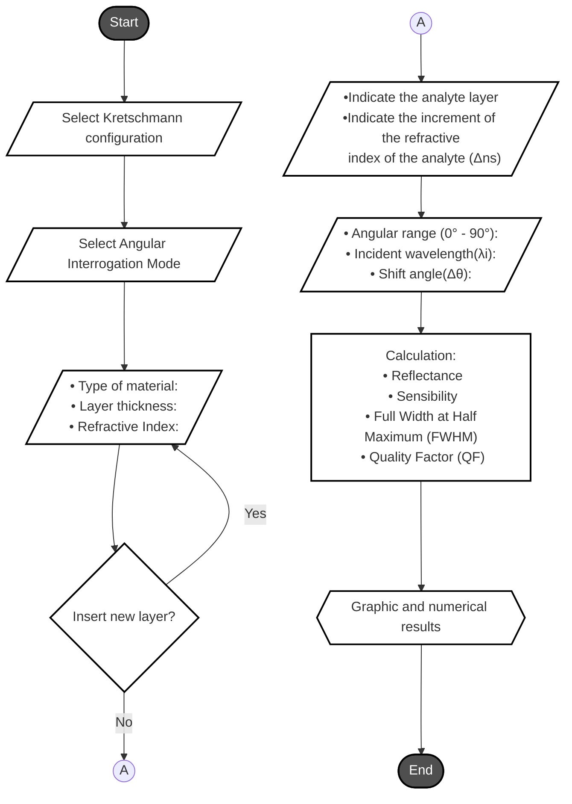

# Sim- LMR 
## Description:
**_Sim-LMR_** is an **open source simulator** in development implemented in **Python** for the **study**, **analysis** and **design** of biosensors based on **Lossy Mode Resonance (LMR)**.

## Characteristics:
  * Open source;
  * Python language;
  * Supports N layers;
  * Kretschmann-Raether configuration;
  * Angular Interrogation Mode;

## Flowchart:

## Author
* **Adeilson de Sousa Leal** - Electrical Engineering Department - Federal University of Campina Grande - UFCG
* **LinkedIn**: https://www.linkedin.com/in/adeilson-de-sousa-leal-8a04271a1/
* **Contact**: adeilson.leal@ee.ufcg.edu.br
